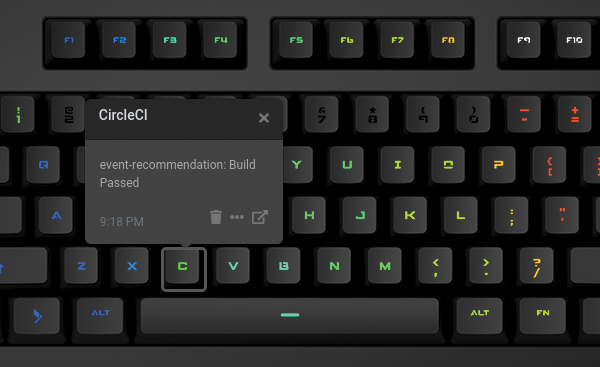

# Q Applet: CircleCI

Get CircleCI build status alerts directly on a Das Keyboard Q keyboard. Requires a CircleCI account
and a personal API token: [https://circleci.com/](https://circleci.com/).

[GitHub repository](https://github.com/brandonschabell/daskeyboard-applet-circleci)

## Example

The "C" key in the image below is green because the build of the repo `event-recommendation` has passed.

## Installation

Requires a Das Keyboard Q Series: www.daskeyboard.com

Installation, configuration and uninstallation of applets is done within
the Q Desktop application [https://www.daskeyboard.com](https://www.daskeyboard.com/q).

## Running tests

- `yarn test`

## Contributions

Pull requests welcome.